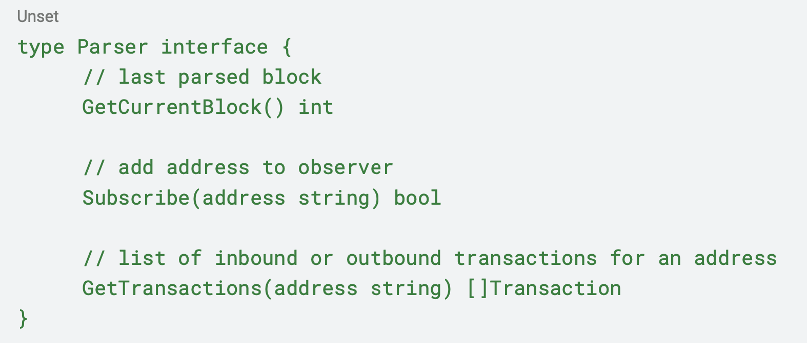
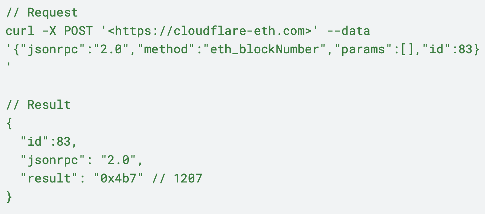

# Stott and May Technical Challenge

## Project: Go Ethereum Subscriptions

## About the challenge
*A Golang project to implement the given task*

### Goal 
*Implement Ethereum blockchain parser that will allow to query transactions for subscribed addresses.*

### Problem 
*Users not able to receive push notifications for incoming/outgoing transactions. By Implementing Parser interface we would be able to hook this up to notifications service to notify about any incoming/outgoing transactions.*

### Limitations
* Use Go Language
* Avoid usage of external libraries
* Use Ethereum JSONRPC to interact with Ethereum Blockchain
* Use memory storage for storing any data (should be easily extendable to support any
storage in the future)

*Expose public interface for external usage either via code or command line or rest api that will
include supported list of operations defined in the Parser interface*

### Endpoint
URL: https://cloudflare-eth.com

Request example

### References
* [Ethereum JSON RPC Interface](https://ethereum.org/en/developers/docs/apis/json-rpc/)

### Note
* keep it simple
* try to finish the task within 4 hours. We do not track the time spent, this is just a
guidance. We do not ask for a perfect production ready service

**[<- Back to README](/./README.md)**